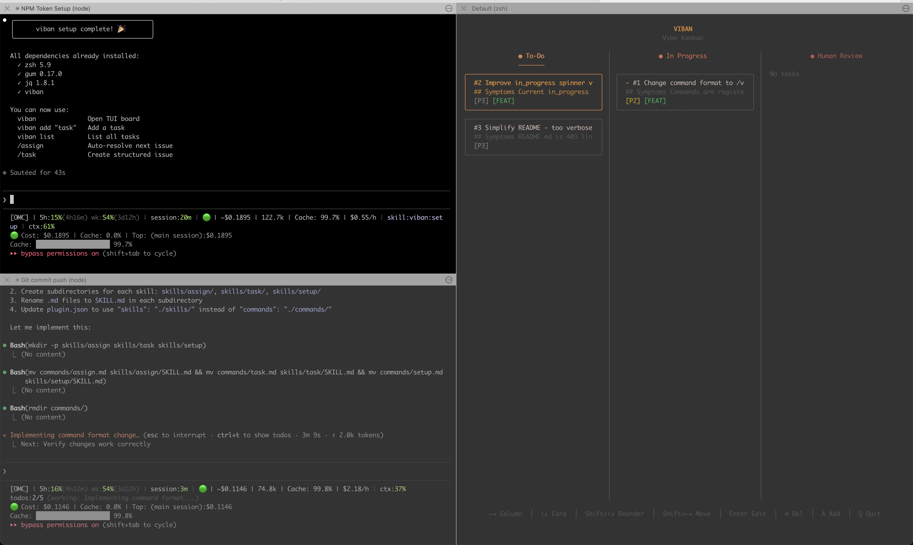

# viban

**Vi**sual Kan**ban** - A simple, lightweight local Kanban board for AI-human collaborative issue tracking.

[](https://github.com/happy-nut/claude-plugin-viban/actions/workflows/ci.yml)
[](https://www.npmjs.com/package/claude-plugin-viban)
[](https://opensource.org/licenses/MIT)



## Why viban?

- **No Worktree Complexity** - Just a single JSON file. No git worktrees, no complex setup.
- **Lightweight & Fast** - Pure shell script with minimal dependencies. Starts instantly.
- **Local First** - Your issues stay in your repo. No external services or accounts needed.
- **AI-Native** - Built for Claude Code integration from the ground up.

## Recommended Workflow

The most effective way to use viban is with **multiple terminal sessions**:

```
┌───────────────────┐  ┌───────────────────┐  ┌───────────────────┐
│    Session 1      │  │    Session 2      │  │    Session 3      │
│                   │  │                   │  │                   │
│  Product QA       │  │  Issue Work       │  │  viban TUI        │
│  + /viban:add     │  │  + /viban:assign  │  │                   │
│                   │  │                   │  │  (always open)    │
│  Find bugs,       │  │  Pick & resolve   │  │  Monitor board    │
│  register issues  │  │  issues           │  │  in real-time     │
└───────────────────┘  └───────────────────┘  └───────────────────┘
```

- **Session 1**: QA your product, find issues, run `/viban:add` to register them
- **Session 2**: Run `/viban:assign` to pick the next issue and resolve it
- **Session 3**: Keep `viban` TUI open to monitor the board

This separation keeps your workflow clean and prevents context switching.

## Features

- **4-Column Kanban Board**: `backlog` → `in_progress` → `review` → `done`
- **Priority Levels**: P0 (critical) to P3 (low priority)
- **Type Tags**: bug, feat, chore, refactor
- **TUI Navigation**: Interactive terminal UI with gum
- **Parallel Sessions**: Multiple Claude Code sessions can work simultaneously
- **Session Assignment**: Prevents duplicate work across parallel agents
- **Claude Code Integration**: Built-in commands for automated issue resolution

## Requirements

- zsh
- python3 (macOS/Linux built-in)
- [gum](https://github.com/charmbracelet/gum)
- [jq](https://jqlang.github.io/jq/)
- [gh](https://cli.github.com/) (optional, for GitHub Issues sync)

> **Tip:** If using Claude Code, run `/viban:setup` to install all dependencies automatically.

## Installation

### For Claude Code Users

```bash
/plugin marketplace add https://github.com/happy-nut/claude-plugin-viban
/plugin install viban
/viban:setup   # Installs all dependencies automatically
```

### For Terminal Users

```bash
curl -fsSL https://raw.githubusercontent.com/happy-nut/claude-plugin-viban/main/install.sh | bash
```

Or via npm (requires zsh, gum, jq pre-installed):
```bash
npm install -g claude-plugin-viban
```

<details>
<summary>Troubleshooting: viban command not found</summary>

Add npm global bin to your PATH:
```bash
# For zsh
echo 'export PATH="$PATH:$(npm config get prefix)/bin"' >> ~/.zshrc && source ~/.zshrc

# For bash
echo 'export PATH="$PATH:$(npm config get prefix)/bin"' >> ~/.bashrc && source ~/.bashrc
```
</details>

## Usage

### TUI (Interactive Mode)

```bash
viban           # Launch TUI
```

**Navigation:**

| Level | Screen | Controls |
|-------|--------|----------|
| 1 | Column List | ↑↓ select, Enter to enter |
| 2 | Card List | ↑↓ select, Enter for details, `a` to add |
| 3 | Card Details | Change status, delete |

**TUI Features:**
- Navigate between backlog, in_progress, review, done columns
- View issue cards with priority and type badges
- Create new issues with rich descriptions
- Move issues between statuses
- Delete issues

### CLI Commands

```bash
viban list                              # Display kanban board
viban add "Title" ["Desc"] [P0-P3] [type] [files...]  # Create new issue
viban attach <id> <file1> [file2...]    # Attach files to issue
viban priority <id> <P0-P3>            # Set priority
viban assign [session-id]               # Assign top backlog issue
viban review [id]                       # Move issue to review
viban done <id>                         # Complete & remove
viban edit <id>                         # Edit issue in editor
viban get <id>                          # Get issue details (JSON)
viban sync                              # Sync with external tracker
viban migrate                           # Migrate: extract type from title
viban update                            # Update to latest version
viban help                              # Show help message
```

**Examples:**

```bash
# Add a high-priority bug
viban add "Fix login error" "Users cannot login after password reset" P1 bug

# Add an issue with file attachments
viban add "Refactor auth" "Simplify login flow" P2 refactor src/auth.ts src/login.ts

# List all issues
viban list

# Assign first backlog issue to current session
viban assign

# Change priority of issue #3
viban priority 3 P1

# Mark issue #5 as done
viban done 5

# Get issue details as JSON
viban get 3
```

### Claude Code Integration

viban provides skills and commands for automated issue management in Claude Code:

#### `/viban:add` - Register structured issue

Analyzes a problem and creates a properly structured viban issue:

1. Clarifies the problem if vague
2. Infers priority and type from description
3. Registers with proper title, description, priority, type
4. Optionally enters plan mode to design a solution

**Use cases:**
- Bug reporting
- Feature requests
- Converting free-form descriptions to structured issues

#### `/viban:assign` - Assign next backlog issue

Picks the highest priority backlog issue and assigns it to the current session:

1. Assigns top backlog issue
2. Evaluates description clarity
3. If unclear, interviews user and enriches the issue description

This command is **assignment only** - it does not start implementation. Use your project's workflow (`.viban/workflow.md`) to define what happens next.

#### `/viban:parallel-assign` - Parallel resolution with worktrees

Resolves multiple backlog issues simultaneously using isolated git worktrees:

1. Assigns N issues (default: 3, max: 5) and creates worktrees
2. Spawns one opus agent per issue in its own worktree
3. Each agent analyzes, implements, commits, and creates a PR
4. Coordinator collects results, runs tests, and cleans up

**Use cases:**
- Batch processing a backlog
- Parallel agent workflows with zero interference
- Rapid issue throughput

#### `/viban:setup` - Install & configure

Installs all dependencies and optionally configures a project workflow:

1. Detects OS and installs missing dependencies (zsh, gum, jq)
2. Installs/updates viban CLI via npm
3. Auto-detects project conventions (build/test, commit style, branch naming)
4. Interviews for workflow preferences (pipeline depth, issue numbering)
5. Generates `.viban/workflow.md` for `/viban:assign` to follow

## External Tracker Sync

viban can sync two-way with external issue trackers. Currently supported: **GitHub Issues**.

### Quick Start

```bash
# First time: initialize sync (auto-detects provider from git remote)
viban sync --init

# Preview what will change
viban sync --dry-run

# Run sync
viban sync
```

> **Tip:** Use `viban sync --dry-run` first to preview changes before syncing.

### How It Works

- **First sync** imports all open remote issues as backlog cards with external IDs (e.g. `github:42`)
- **Subsequent syncs** pull remote changes and push local status updates
- **New local cards** are NOT pushed unless `--push-new` is specified (local-first default)
- **Conflicts** (both sides changed) resolve to remote-wins by default

### Status-to-Label Mapping

| viban status | GitHub label |
|-------------|-------------|
| `backlog` | *(no label)* |
| `in_progress` | `in-progress` |
| `review` | `review` |
| `done` | *(issue closed)* |

### Requirements

- [gh CLI](https://cli.github.com/) installed and authenticated (`gh auth login`)
- Repository must have a GitHub remote

## Configuration

### Data Location (viban.json)

viban stores issues in `viban.json` with the following priority:

| Priority | Location | When Used |
|----------|----------|-----------|
| 1 | `$VIBAN_DATA_DIR` | Explicit override via environment variable |
| 2 | `.viban/` | Default (all projects) |

**Auto-Migration:** If viban detects `viban.json` or `sync.json` in `.git/` (legacy location), it automatically moves them to `.viban/`.

**For Any Project:**
```bash
# viban will automatically create .viban/viban.json in current directory
cd /path/to/project
viban add "First issue" "Description" P2 feat
# Creates: /path/to/non-git-project/.viban/viban.json
```

**Custom Data Directory:**
```bash
export VIBAN_DATA_DIR="/path/to/shared/data"
viban list  # Uses /path/to/shared/data/viban.json
```

### Auto-Initialization

viban automatically initializes when first used:
- Creates data directory if not exists
- Creates `viban.json` with empty issue list
- No manual setup required

### Issue Status Flow

```
backlog → in_progress → review → done
            ↑              ↑
      (assign)       (complete)
```

### Priority Levels

| Priority | Description |
|----------|-------------|
| **P0** | Critical - blocks all work |
| **P1** | High - must do soon |
| **P2** | Medium - normal priority |
| **P3** | Low - nice to have |

### Type Tags

| Type | Use Case |
|------|----------|
| **bug** | Fixing broken functionality |
| **feat** | New feature or enhancement |
| **refactor** | Code restructuring |
| **chore** | Maintenance tasks |

## Data Structure

Issues are stored in `viban.json`:

```json
{
  "version": 1,
  "issues": [
    {
      "id": 1,
      "title": "Fix authentication bug",
      "description": "Users cannot login after password reset",
      "status": "in_progress",
      "priority": "P1",
      "type": "bug",
      "assigned_to": "session-abc123",
      "created_at": "2025-01-23T10:00:00Z",
      "updated_at": "2025-01-23T14:30:00Z"
    }
  ]
}
```

## Parallel Session Handling

Multiple Claude Code sessions can work simultaneously:

1. Each session calls `/viban:assign`
2. Session ID is recorded in `assigned_to` field
3. Other sessions skip already-assigned issues
4. Completion moves issue to `review` or `done`

This prevents duplicate work and enables parallel agent workflows.

## File Structure

```
claude-plugin-viban/
├── .claude-plugin/
│   └── plugin.json              # Plugin metadata
├── .github/
│   └── workflows/
│       ├── ci.yml               # CI testing
│       └── release.yml          # NPM publishing
├── bin/
│   └── viban                    # Main TUI/CLI script
├── commands/
│   ├── add.md                   # /viban:add command
│   ├── assign.md                # /viban:assign command
│   ├── parallel-assign.md       # /viban:parallel-assign command
│   └── setup.md                 # /viban:setup command
├── docs/
│   ├── CLAUDE.md                # Claude Code integration guide
│   └── release.md               # Release workflow
├── scripts/
│   ├── check-deps.sh            # Dependency checker
│   ├── generate-release-notes.sh # Release notes generator
│   ├── sync.sh                  # Core sync engine (provider-agnostic)
│   ├── sync_create.sh           # Sync initialization
│   ├── providers/
│   │   └── github.sh            # GitHub Issues provider
│   └── tui_coprocess.py         # Persistent Python coprocess for TUI rendering
├── skills/
│   ├── add/SKILL.md             # /viban:add skill
│   ├── assign/SKILL.md          # /viban:assign skill
│   ├── parallel-assign/SKILL.md # /viban:parallel-assign skill
│   └── setup/SKILL.md           # /viban:setup skill
├── tests/
│   ├── run_all.zsh              # Test runner
│   ├── test_cmd_add.zsh         # Add command tests
│   ├── test_coprocess.zsh       # Python coprocess tests
│   ├── test_install.zsh         # Installation tests
│   ├── test_layout.zsh          # TUI layout tests
│   ├── test_pad_width.zsh       # Unicode width tests
│   ├── test_sort_order.zsh      # Sort order tests
│   ├── test_sync.zsh            # Sync engine tests
│   └── test_sync_auto.zsh       # Auto-sync tests
├── LICENSE                      # MIT License
├── package.json                 # NPM package config
└── README.md                    # This file
```

## Development

### Running Tests

```bash
# Install dependencies
brew install gum jq

# Run the full test suite (8 suites, 39 tests)
zsh tests/run_all.zsh
```

### Publishing

See [docs/release.md](docs/release.md) for the full release workflow.

```bash
# GitHub Actions will automatically publish to npm on tag push
```

## Contributing

Contributions are welcome! Please:

1. Fork the repository
2. Create a feature branch (`git checkout -b feature/amazing-feature`)
3. Commit your changes (`git commit -m 'Add amazing feature'`)
4. Push to the branch (`git push origin feature/amazing-feature`)
5. Open a Pull Request

## License

MIT License - see [LICENSE](LICENSE) file for details.

## Author

**happy-nut**

- GitHub: [@happy-nut](https://github.com/happy-nut)
- Repository: [claude-plugin-viban](https://github.com/happy-nut/claude-plugin-viban)

## Links

- [npm package](https://www.npmjs.com/package/claude-plugin-viban)
- [Documentation](https://github.com/happy-nut/claude-plugin-viban/tree/main/docs)
- [Issues](https://github.com/happy-nut/claude-plugin-viban/issues)
