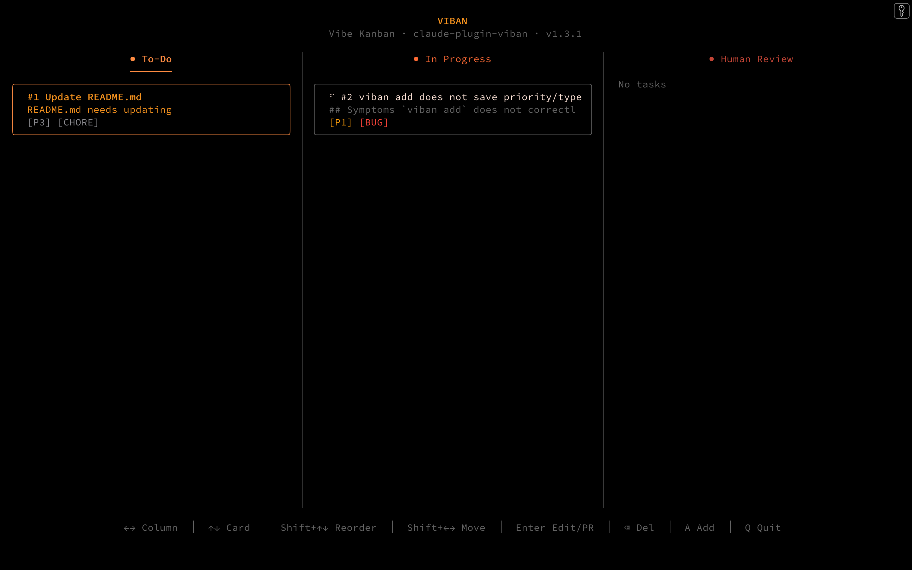

# viban

**Vi**sual Kan**ban** — Issue tracking designed for AI agents.

[](https://github.com/happy-nut/claude-plugin-viban/actions/workflows/ci.yml)
[](https://www.npmjs.com/package/claude-plugin-viban)
[](https://opensource.org/licenses/MIT)



Register bugs. Claude picks them up, resolves them, and creates PRs — while you keep finding the next issue.

```bash
# You find a bug and register it
/viban:add "Login fails after password reset"

# Claude assigns itself the top-priority issue and starts working
/viban:assign

# Or resolve 3 issues in parallel — each in its own git worktree
/viban:parallel-assign 3
```

## Why viban?

GitHub Issues, Linear, and Jira are built for humans coordinating with humans. viban is built for **humans coordinating with AI agents**.

| | Traditional trackers | viban |
|---|---|---|
| **Who resolves issues?** | Human developers | AI agents (Claude Code) |
| **Parallel work** | Manual branch management | Isolated worktrees, zero conflicts |
| **Where it lives** | External SaaS | Your repo (single JSON file) |
| **Setup** | Accounts, permissions, integrations | `npm install -g claude-plugin-viban` |
| **Context switching** | Browser ↔ terminal | Everything in terminal |
| **Already using GitHub Issues?** | — | Two-way sync included |

## Quick Start

### For Claude Code Users

```bash
/install claude-plugin-viban
/viban:setup
```

### For Terminal Users

```bash
npm install -g claude-plugin-viban
```

Then start tracking:

```bash
viban add "Fix login error" "Users cannot login after password reset" P1 bug
viban add "Add dark mode" P2 feat
viban                        # Open TUI board
```

## How It Works

### Sequential Mode

Run multiple terminal sessions — one for QA, one for resolution, one for monitoring:


```
┌───────────────────┐  ┌───────────────────┐  ┌───────────────────┐
│    Session 1      │  │    Session 2      │  │    Session 3      │
│                   │  │                   │  │                   │
│  Product QA       │  │  Issue Work       │  │  viban TUI        │
│  + /viban:add     │  │  + /viban:assign  │  │                   │
│                   │  │                   │  │  (always open)    │
│  Find bugs,       │  │  Pick & resolve   │  │  Monitor board    │
│  register issues  │  │  issues           │  │  in real-time     │
└───────────────────┘  └───────────────────┘  └───────────────────┘
```

### Parallel Mode

Resolve multiple issues at once with `/viban:parallel-assign`:

```
┌───────────────────┐
│   Coordinator     │  /viban:parallel-assign 3
│                   │
│  Assigns issues,  │──┬──────────────────────────────────────┐
│  creates worktrees│  │                                      │
│  collects results │  ▼                  ▼                   ▼
│                   │  ┌──────────┐  ┌──────────┐  ┌──────────┐
│                   │  │ Agent 1  │  │ Agent 2  │  │ Agent 3  │
│                   │  │ wt/#12   │  │ wt/#13   │  │ wt/#14   │
│                   │  │ Analyze  │  │ Analyze  │  │ Analyze  │
│                   │  │ Implement│  │ Implement│  │ Implement│
│                   │  │ Commit   │  │ Commit   │  │ Commit   │
│  Push, create PRs │  └──────────┘  └──────────┘  └──────────┘
│  Run tests, report│
└───────────────────┘
```

- Each agent works in an isolated git worktree (`.viban/worktrees/{ID}`)
- Zero interference between agents — no merge conflicts
- Coordinator pushes branches, creates PRs, and runs tests after all agents finish

## Claude Code Skills

These are the core AI-agent commands. Each one is a Claude Code slash command.

### `/viban:add` — Register an issue

Analyzes your description and creates a structured issue with proper priority, type, and description.

```
/viban:add "Search is broken on mobile"
→ Infers: P1 bug, enriches description, registers to backlog
```

### `/viban:assign` — Assign and resolve

Picks the highest-priority unblocked backlog issue, assigns it, and follows your project's workflow to resolve it.

```
/viban:assign
→ Picks #7 (P0 bug), analyzes code, implements fix, creates PR
```

### `/viban:parallel-assign` — Parallel resolution

Assigns N issues (default 3, max 5) and spawns one agent per issue in isolated git worktrees.

```
/viban:parallel-assign 3
→ Assigns #8, #9, #10 — three agents work simultaneously
→ Each commits on its own branch, coordinator creates PRs
```

### `/viban:setup` — Install and configure

Installs dependencies, detects your project conventions, and generates a workflow file.

## TUI

```bash
viban    # Launch interactive board
```

3-column Kanban board (backlog → in_progress → review). Completed issues move to history.

| Level | Screen | Controls |
|-------|--------|----------|
| 1 | Column List | ↑↓ select, Enter to enter |
| 2 | Card List | ↑↓ select, Enter for details, `a` to add |
| 3 | Card Details | Change status, delete |

## CLI Reference

```bash
# Board
viban list                                          # Show board
viban list --status backlog --priority P0,P1        # Filter
viban list --type bug --search "auth"               # Search
viban history                                       # Completed issues
viban stats                                         # Throughput metrics
viban export [md|html]                              # Export board

# Issues
viban add "Title" ["Desc"] [P0-P3] [type] [--parent <id>]
viban edit <id>                                     # Edit in editor
viban get <id>                                      # JSON details
viban priority <id> <P0-P3>
viban comment <id> "msg"
viban attach <id> <file1> [file2...]

# Workflow
viban assign                                        # Assign top backlog
viban review [id]                                   # → review
viban move <id> <status>                            # → any status
viban done <id> [--purge] [--dry-run]               # → done

# Dependencies
viban link <id> blocks <id>
viban unlink <id> blocks <id> [--dry-run]

# Maintenance
viban sync                                          # GitHub sync
viban backup / viban restore [file]
viban changelog [range]
viban update
```

<details>
<summary><strong>GitHub Issues Sync</strong></summary>

Two-way sync with GitHub Issues. Comments, dependencies, and sub-tasks are synced.

```bash
viban sync --init       # Initialize (auto-detects from git remote)
viban sync --dry-run    # Preview changes
viban sync              # Pull + push
viban sync --push-new   # Push local-only issues to GitHub
```

**Status mapping:**

| viban | GitHub |
|-------|--------|
| `backlog` | *(no label)* |
| `in_progress` | `in-progress` |
| `review` | `review` |
| `done` | *(issue closed)* |

Requires [gh CLI](https://cli.github.com/) authenticated with `gh auth login`.

</details>

<details>
<summary><strong>Issue Templates</strong></summary>

Create `.viban/templates.json` to define defaults per issue type:

```json
{
  "bug": {
    "priority": "P1",
    "description": "## Bug Report\n\n**Steps to reproduce:**\n\n**Expected:**\n\n**Actual:**"
  },
  "feat": {
    "priority": "P2",
    "description": "## Feature\n\n**User story:**\n\n**Acceptance criteria:**"
  }
}
```

Unset fields are filled from the template when the type matches.

</details>

<details>
<summary><strong>Configuration</strong></summary>

### Data Location

| Priority | Location | When |
|----------|----------|------|
| 1 | `$VIBAN_DATA_DIR` | Explicit override |
| 2 | `.viban/` | Default |

Auto-migrates from legacy `.git/` location.

### Priority Levels

| Priority | Description |
|----------|-------------|
| **P0** | Critical — blocks all work |
| **P1** | High — must do soon |
| **P2** | Medium — normal priority |
| **P3** | Low — nice to have |

### Type Tags

`bug` · `feat` · `refactor` · `chore`

### Status Flow

```
backlog → in_progress → review → done
   ↑           ↑           │
   └───────────┴───────────┘
        (viban move)
```

</details>

<details>
<summary><strong>Data Structure</strong></summary>

Issues are stored in `.viban/viban.json`:

```json
{
  "version": 2,
  "next_id": 4,
  "issues": [
    {
      "id": 1,
      "title": "Fix authentication bug",
      "description": "Users cannot login after password reset",
      "status": "in_progress",
      "priority": "P1",
      "type": "bug",
      "assigned_to": "session-abc123",
      "parent_id": null,
      "blocked_by": [3],
      "comments": [
        {"text": "Root cause found", "created_at": "2026-01-23T14:00:00Z"}
      ],
      "attachments": [],
      "created_at": "2026-01-23T10:00:00Z",
      "updated_at": "2026-01-23T14:30:00Z"
    }
  ]
}
```

</details>

## Requirements

- zsh
- python3 (macOS/Linux built-in)
- [gum](https://github.com/charmbracelet/gum)
- [jq](https://jqlang.github.io/jq/)
- [gh](https://cli.github.com/) (optional, for GitHub sync)

## Development

```bash
brew install gum jq
zsh tests/run_all.zsh    # 19 suites, 212 tests
```

See [docs/release.md](docs/release.md) for publishing.

## Contributing

1. Fork the repository
2. Create a feature branch
3. Commit your changes
4. Open a Pull Request

## License

MIT — see [LICENSE](LICENSE).

## Links

- [npm](https://www.npmjs.com/package/claude-plugin-viban) · [Issues](https://github.com/happy-nut/claude-plugin-viban/issues) · [Docs](https://github.com/happy-nut/claude-plugin-viban/tree/main/docs)
